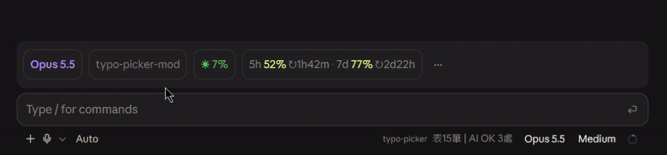

<div align="center">

# typo-picker

**注音選錯字，送出前就抓到。**

一個 **Claude Code Mod**：替 Claude Code 的輸入列加上選字列。邊打邊畫底線，輸入列上方直接跳出候選字，點一下就換掉。


</div>



---

## 為什麼需要它

用注音打字，同音字選錯是日常：**以經、在麻煩、因該、做業**。微軟注音不會提醒你，Claude 通常也看得懂，所以錯字就這樣一路留在你的 prompt、commit message 和文件裡。

typo-picker 在你按下 Enter 之前把它們挑出來。

## 三個重點

| | |
|---|---|
| ⚡ **打完就標** | 錯字表在本機比對，沒有延遲，不花 token |
| 🤖 **停 1 秒，AI 補抓** | 錯字表沒收錄的，交給 AI 檢查，中英文都抓 |
| 📈 **越用越準** | AI 抓到的錯字按「存表」，錯詞和新詞都能先改再存 |

## 安裝

**在 Claude Code 裡面**（輸入列直接打，終端機和桌面 App 都可以）：

```text
/plugin marketplace add jaaaackieLai/claude-mods
```

```text
/plugin install typo-picker@claude-mods
```

**或在終端機**：

```bash
claude plugin marketplace add jaaaackieLai/claude-mods
```

```bash
claude plugin install typo-picker@claude-mods
```

**更新到最新版**：在 Claude Code 裡打 `/plugin marketplace update claude-mods`，或在終端機執行 `claude plugin marketplace update claude-mods`。

## 用法

| 想做的事 | 做法 |
|---|---|
| 換成候選字 | 點候選列的按鈕，或在輸入列打 `\` 加數字（`\1` 是第 1 個，`\` 會自動刪掉）。在 Terminal 也可以按 Alt+數字 |
| 忽略這個錯字 | 點「忽略」（只在這個 session 有效） |
| 把 AI 抓到的錯字存進錯字表 | 點「存表」，上方會出現「錯詞」「新詞」兩個輸入框，按 Enter 或「存」。新詞有多個就用空白隔開 |
| 修改錯字表裡的規則 | 點「改表」，用法同上；改了錯詞，舊的那行會一起換掉 |
| 新增 AI 沒抓到的錯字 | 打 `/typo`，輸入列上方會出現空白的「錯詞」「新詞」輸入框；也會顯示錯字表位置和筆數 |
| 直接用指令新增規則 | `/typo 錯詞 新詞 [新詞2…]`，錯詞已存在時會覆蓋 |
| 查看 AI 上一次檢查的原文和回覆 | `/typo last` |

狀態列會顯示 `表12筆 | AI OK 1處` 這類資訊：錯字表筆數和 AI 檢查結果。

<details>
<summary><b>錯字表格式</b></summary>

位置：`~/.claude/typo-picker/rules.txt`，第一次啟動時自動建立，內建繁體中文和英文常見錯字各 30 筆。

```text
# 每行一筆：錯詞 候選1 候選2 ...（空白隔開），# 開頭是註解
因該 應該
竟量 盡量 儘量
teh the
```

存檔後 3 秒內自動生效，不用重新啟動。

</details>

<details>
<summary><b>AI 檢查的細節</b></summary>

- 停止打字 1 秒後送出整段草稿，模型是 `claude-opus-5-5`（effort `low`）
- 少於 4 個字、`/` 開頭的指令、內容沒變過，都不會送出；草稿只取前 2000 字
- 中文錯字會要求 AI 先寫出注音再找候選字，候選字要是讀音相近的真詞、只用繁體。這是給 AI 的指示，AI 偶爾還是會給錯，這時用 `/typo` 自己補進錯字表
- AI 抓到的錯字和錯字表的顏色不同，候選列前面會標 `AI`
- 同一個位置兩邊都抓到時，以錯字表為準

</details>

## 隱私與費用

- AI 檢查會把**你正在打的草稿**傳送給 AI 模型，同樣算在 Claude 用量額度裡
- 錯字表只儲存在你的電腦上

